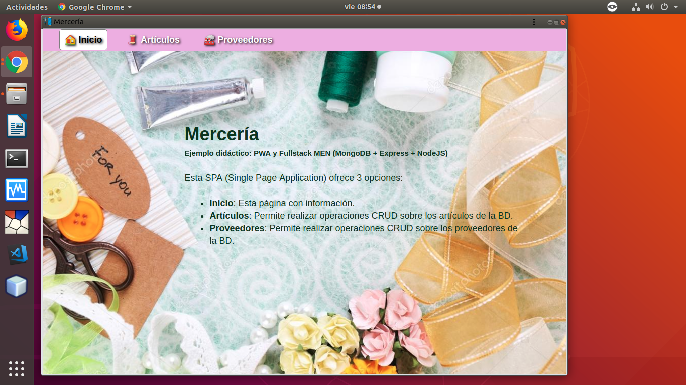

# Merceria
# PWA + FullStack (MongoDB, Express, NodeJs)

## Introducción

Actualmente está desplegado en [Heroku](https://merceria.herokuapp.com/).

La aplicación está desarrollada además como PWA (Progressive Web App). Esto quiere decir que si la abres con Android y pulsas en la opción "Añadir a pantalla de inicio", se te instalará dicha aplicación en tu móvil como si tratará de una aplicación nativa. 

Se utilizan los mínimos recursos (ya sean estos paquetes, librerías o frameworks). Tambien se intenta minimizar el número de archivos utilizados. Este proyecto **NO** necesita de frameworks como Angular, React o Vue para el FrondEnd, ya que hacemos uso de [VanillaJS](http://vanilla-js.com/) . 

La interfaz está desarrollada en forma de SPA (Single Page Application).


Los archivos utilizados son los siguientes:

Para el BackEnd los archivos necesarios son:

- package.json
- config.js
- models.js
- routes.js

Para el FrontEnd los archivos necesarios son:

- public/favicon.png
- public/index.html
- public/style.css
- public/app.js

Para Aplicación Web Progresiva

- public/manifest.json
- public/service-worker.js
- public/images/icons/*


## Despliegue en local

Para poder ejecutar este proyecto en tu equipo local, sigue los siguientes pasos: 

1. Instala el servidor MongoDB. [Consulta la página oficial](https://docs.mongodb.com/manual/installation/).
2. Clona este repositorio en tu equipo:
  ```bash
  git  clone  https://github.com/AmeliaPaniagua/Merceria.git
  cd   merceria
  ```
3. Instala los módulos necesarios;
  ```bash
  npm  install
  ```
4. Inicia la aplicación
  ```bash
  npm  start
  ```
5. Abre en el navegador web la URL `http://localhost:3000`.


## Despliegue en Heroku + mLab

Actualmente la aplicación está desplegada en [HEROKU](https://www.heroku.com). Como base de datos utiliza DBaaS MongoDB proporcionado por [MLAB](https://mlab.com).

Para hacer el despligue, sigue estos pasos: 

1. Crear una cuenta en Heroku. Éste tiene varios [planes](https://www.heroku.com/pricing). Registrate en el plan Free, que aunque está algo limitado es gratis.

2. Instala la herramienta `heroku-cli`. En [este enlace](https://devcenter.heroku.com/articles/heroku-cli) tienes la información necesaria.

3. Clona este repositorio en tu equipo:
  ```bash
  git  clone  https://github.com/AmeliaPaniagua/Merceria.git
  cd   merceria
  ```

4. Inicia sesión desde el terminal en la cuenta que previamente creaste en Heroku. Y crea una nueva aplicación. 
  
  ```bash
  heroku login --interactive
  heroku create --region eu  nombre_aplicacion
  ```
  
  **NOTA:** Debes sustituir `nombre_aplicacion` por el nombre que desees dar a tu aplicación. Ten en cuenta que no puede tener espacios en blanco ni tildes. Probablemente tengas que probar con varios nombres, pues muchos de ellos ya están ocupados. La opción `--region eu` es para que la aplicación se aloje en servidores de Europa. 
  
5. Despliega el código en Heroku.

  ```bash
  heroku  push  heroku  master
  ```

  Dentro de unos instantes podrás acceder a la aplicación en la url `http://nombre_aplicacion.herokuapp.com`. 
  
  **NOTA:** Debes sustituir `nombre_aplicacion` por el nombre de tu aplicación.
  
  Puedes verla abriendo dicha url en el navegador o ejecutando
  
  ```bash
  heroku  open
  ```
  
### Instalacción en PC o Portátil

El sistema operativo usuado a sido Ubuntu 18.04.2 LTS y el navegador Google Chrome Versión 72.0.3626.121 (Build oficial) (64 bits).


Para instalar en el escritorio a través del navegador Chrome, seguimos los siguientes pasos.

1. Pulsamos en el menú del navegador y luego en **Instalar Mercería ...**

  
  
2. Confirmamos

  

3. Una vez instalada nos aparecerá un icono en el escritorio.

  

4. Ahora podemos buscar en el equipo la aplicación instalada.

  
  
  
  
  ## Desinstalación en PC o Portátil
  Por último, si deseamos desinstalar la aplicación, bastará con pulsar en el menú de la ventana y luego en Desinstalar ...
  
  
  
  
  
  
